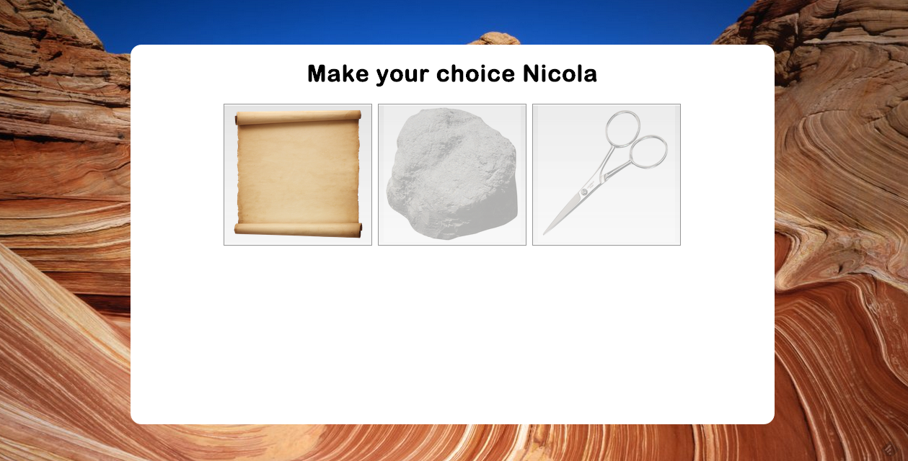

Rock-Paper-Scissors
===================

Week 5 Challenge at Makers Academy. The aim was to take a working ruby version of Rock-Paper-Scissors, make it work in the browswer and then deploy it to Heroku.



###Technologies used

+ Ruby
+ Heroku
+ Sinatra
+ HTML
+ CSS
+ Git

###How to set it up

```sh
git clone rockpaperscissors
cd rockpaperscissors
bundle install
```

###How to run it

```sh
cd rockpaperscissors
rackup
```

visit localhost:9292 in the browser to view.

###Future Improvements

+ Implement a two-player version of the game
